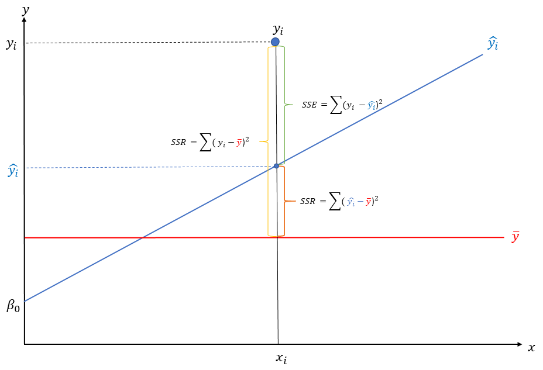

```{r setup, include=FALSE}
options(htmltools.dir.version = FALSE)
```


# Regresión lineal múltiple

$$\underbrace{~~~~~\hat{y}~~~~~}_{\text{Dependiente}} = \underbrace{\hat{\beta_0}+\hat{\beta}_1X_1+\hat{\beta}_iX_i}_\text{componente lineal} + \underbrace{~~~~~\epsilon_~~~~~}_{\text{residuo}}$$ 

$\beta$ representa al coeficiente de regresión. Este nos indica la magnitud del cambio de la variable dependiente $y$ por el cambio de una unidad de nuestra vriable independiente $x$, mantienendo todas las demás variables en valores constantes (*ceteris paribus*). 

Este coeficiente nos permite conocer si existe asociación entre nuestra variables, así también, a través de la prueba de hipótesis que realiza el test del análisis de regresión, es posible señalar si exite asociacón estadísticamente significativa.

---
class: middle, center

```{r, echo=FALSE, out.width='100%', fig.cap="Ajuste de un modelo de regresión"}

```

---

# Coeficiente de Determinación

$$R^2=\frac{\text{SSR}}{\text{SST}} = 1 - \frac{\text{SSE}}{\text{SST}}$$

> $\text{Sum Square Total}  \rightarrow  \text{SST}= \sum(y-\bar{y})^2$

> $\text{Sum Square Error}  \rightarrow \text{SSE}= \sum(y-\hat{y})^2$

> $\text{Sum Square Regression}  \rightarrow \text{SSR}= \sum(\hat{y}-\bar{y})^2$

---


