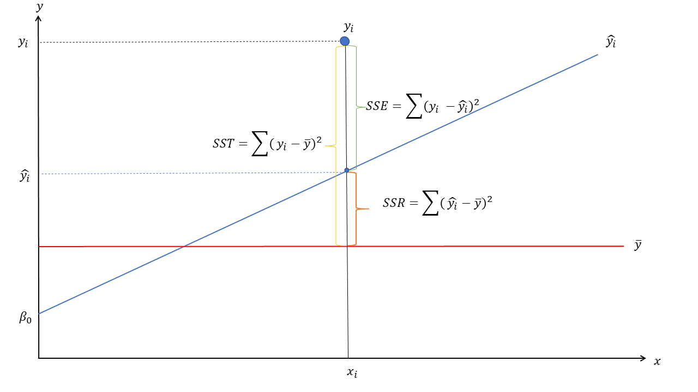

```{r setup, include=FALSE}
options(htmltools.dir.version = FALSE)
```

```{r include=FALSE, cache=FALSE}
library(MASS)
library(ggplot2)
library(lmtest)
library(texreg)
basedatos<-read.csv("basedatosII.csv",header=TRUE, sep=",")
basedatos$X=NULL # eliminar la columna de nombre "X"
#------------------------------------------------------------------------------#
m1A <- lm(PuntajeA ~ TiempoA+AutopercepcionA+GeneroA,data=basedatos)
m2A <- lm(PuntajeA ~ TiempoA+AutopercepcionA,data=basedatos)
m1B <- lm(PuntajeB ~ TiempoB+AutopercepcionB+GeneroB,data=basedatos)
m2B <- lm(PuntajeB ~ TiempoB+AutopercepcionB,data=basedatos)
```


# Contenidos 

### - Análisis de Residuos
### - Homocedasticidad
### - Test de Durbin-Watson: 
 
---
# Paquetes

```{r eval=FALSE, include=TRUE}
# Para instalar las librerías:
install.packages("MASS")
install.packages("ggplot2")
install.packages("lmtest")
install.packages("texreg")
```


---

# Regresión lineal múltiple

### $$\underbrace{~~~~~\hat{y}~~~~~}_{\text{Dependiente}} = \underbrace{\hat{\beta_0}+\hat{\beta}_1X_1+\hat{\beta}_iX_i}_\text{componente lineal} + \underbrace{~~~~~\epsilon_~~~~~}_{\text{residuo}}$$
---
class: middle, center
```{r, echo=FALSE, out.width='100%', fig.cap="Ajuste de un modelo de regresión"}

```

---
# Los Modelos 

- Modelo 1: TiempoA, AutopercepcionA y GeneroA
- Modelo 2: TiempoA y AutopercepcionA    
- Modelo 3: TiempoB, AutopercepcionB y GeneroB
- Modelo 4: TiempoB y AutopercepcionB 


$\hat{y}_{\text{Puntaje}}= \hat{\beta_0}+\hat{\beta}_{\text{TiempoA}}+\hat{\beta}_{\text{AutopercepcionA}}+\hat{\beta}_{\text{GeneroA}}+\epsilon$

$\hat{y}_{\text{Puntaje}}= \hat{\beta_0}+\hat{\beta}_{\text{TiempoA}}+\hat{\beta}_{\text{AutopercepcionA}}+\epsilon$


---
class: middle, center
# Supuestos


---
# Distribución de los residuos I

```{r, results='hold'}
options(scipen=999)
mean(m2A$residuals) 
mean(m1B$residuals)
```

---
# Distribución de los residuos II

```{r out.width=c('75%'), fig.align='center'}
qqnorm(rstandard(m2A), pch = 1, frame = FALSE)
```

 
---
# Homocedasticidad

```{r echo=TRUE, fig.align='center', out.width='75%'}
plot(fitted.values(m2A),
     rstandard(m2A),
     xlab = "Residuos",
     ylab = "Valores predichos",
     main = "Correlación de Residuos y Valores predichos")
```
 

---
# Test de Durbin-Watson 

Se utiliza para chequear el supuesto de *independencia de los residuos* o que los residuos están distribuidos de manera aleatoria, es decir que no siguen un patrón determinado en términos de su distribución. 


$$H_0: \rho = 0$$ 

* Lo que esperamos es no rechazar $H_0$, es decir, que la correlación sea 0 $\checkmark\checkmark\checkmark$.

```{r}
dwtest(m2A) # función del paquete 'lmtest'
```

---

# Coeficiente de Determinación

$$R^2=\frac{\text{SSR}}{\text{SST}} = 1 - \frac{\text{SSE}}{\text{SST}}$$

> $\text{Sum Square Total}  \rightarrow  \text{SST}= \sum(y-\bar{y})^2$

> $\text{Sum Square Error}  \rightarrow \text{SSE}= \sum(y-\hat{y})^2$

> $\text{Sum Square Regression}  \rightarrow \text{SSR}= \sum(\hat{y}-\bar{y})^2$

  
---
class:middle, center

# Sitio web del curso:

[**https://jciturras.github.io/met-cuanti-doc19/**](https://jciturras.github.io/met-cuanti-doc19/)
---
class: center, middle

# Taller 02

Slides created via the R package [**xaringan**](https://github.com/yihui/xaringan).

The chakra comes from [remark.js](https://remarkjs.com), [**knitr**](http://yihui.name/knitr), and [R Markdown](https://rmarkdown.rstudio.com).


