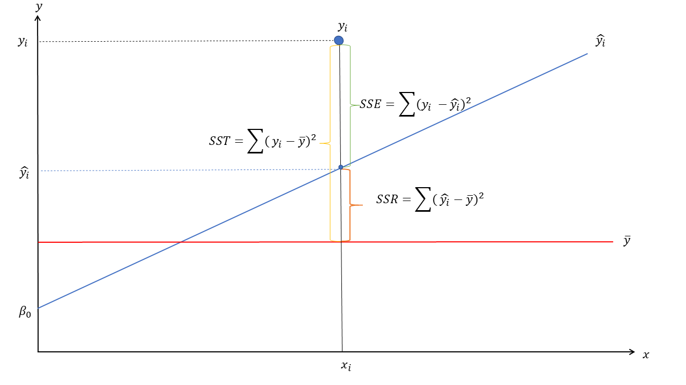

```{r include=FALSE}
library(here)
knitr::opts_knit$set(root.dir = here::here("slides","taller03"))
```

```{r include=FALSE, cache=FALSE, eval=TRUE}
library(dplyr)
library(texreg)
data_psu<-read.csv("psu_edpad.csv",header=TRUE, sep=",")
data_psu$X= NULL
#------------------------------------------------------------------------------#

```


# Contenidos 

### - Regresión Múltiple 
### - Variable Moderadora 
### - Interacciones
### - Transformaciones (estandarización y centrado a la media grupal))
 
---
# Paquetes

```{r eval=FALSE, include=TRUE}
# Para instalar las librerías:
install.packages("dplyr")
install.packages("texreg")

library(dplyr)
library(texreg)
```


---

# Regresión lineal múltiple

### $$\underbrace{~~~~~\hat{y}~~~~~}_{\text{Dependiente}} = \underbrace{\hat{\beta_0}+\hat{\beta}_1X_1+\hat{\beta}_iX_i}_\text{componente lineal} + \underbrace{~~~~~\epsilon_~~~~~}_{\text{residuo}}$$

---
```{r, echo=FALSE, out.width='100%', fig.cap="Ajuste modelo de regresión"}

```

---
```{r, echo=FALSE, out.width='90%', fig.cap="Moderación de una asociación"}

```

---

```{r, echo=FALSE, out.width='90%', fig.cap="Moderación Ajuste modelo"}
knitr::include_graphics('images/interaction02.png')
```


---
```{r echo=FALSE, results='asis'}
stargazer::stargazer(data_psu,
                     type = "html")
```


---
# Los Modelos 

- Modelo 1: psuz ~ edc + fem 
- Modelo 2: psuz ~ edc + fem + edc*fem    

```{r}
model_01 <- lm(psu_z ~ 1 + edc + fem, data = data_psu) 
model_02 <- lm(psu_z ~ 1 + edc + fem + edc:fem, data = data_psu) 
```


### $\hat{y}_{\text{psu_z}}= \hat{\beta_0}+\hat{\beta}_{\text{edc}}+\hat{\beta}_{\text{fem}}+\epsilon$


### $\hat{y}_{\text{psu_z}}= \hat{\beta_0}+\hat{\beta}_{\text{edc}}+\hat{\beta}_{\text{fem}}+\hat{\beta}_{\text{educ*fem}}+\epsilon$

---

```{r echo=TRUE, eval=FALSE}
library(sjPlot)
plot_model(model_02, 
           type = "pred", 
           terms = c("edc"), 
           title = "Valores predichos de psu_z",
           axis.title = c("Educación","PSU"))
plot_model(model_02, 
           type = "pred", 
           terms = c("edc", "fem"), 
           title = "Valores predichos de psu_z según sexo",
           axis.title = c("Educación","PSU"))
```


```{r echo=FALSE, message=FALSE, warning=FALSE, out.width=c('50%','50%')}
library(sjPlot)
plot_model(model_02, 
           type = "pred", 
           terms = c("edc"), 
           title = "Valores predichos de psu_z",
           axis.title = c("Educación","PSU"))
plot_model(model_02, 
           type = "pred", 
           terms = c("edc", "fem"), 
           title = "Valores predichos de psu_z según sexo",
           axis.title = c("Educación","PSU"))
```
---

```{r echo=FALSE, results='asis'}
htmlreg(list(model_01,model_02),
        doctype = FALSE,
        caption = "Modelos para PSU", 
        caption.above = TRUE)
```

---

class:middle, center

# Sitio web del curso:

[**https://jciturras.github.io/met-cuanti-doc19/**](https://jciturras.github.io/met-cuanti-doc19/)
---
class: center, middle

# Taller 03

Slides created via the R package [**xaringan**](https://github.com/yihui/xaringan).

The chakra comes from [remark.js](https://remarkjs.com), [**knitr**](http://yihui.name/knitr), and [R Markdown](https://rmarkdown.rstudio.com).


