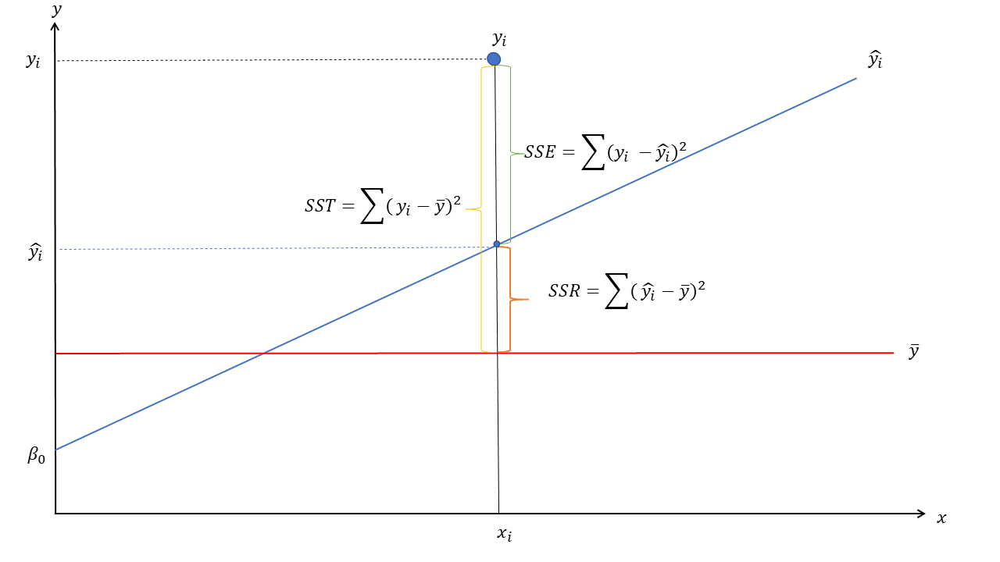
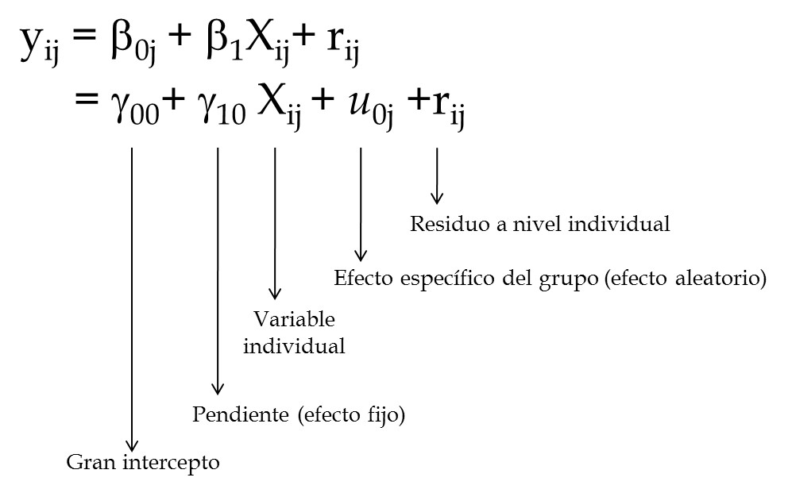
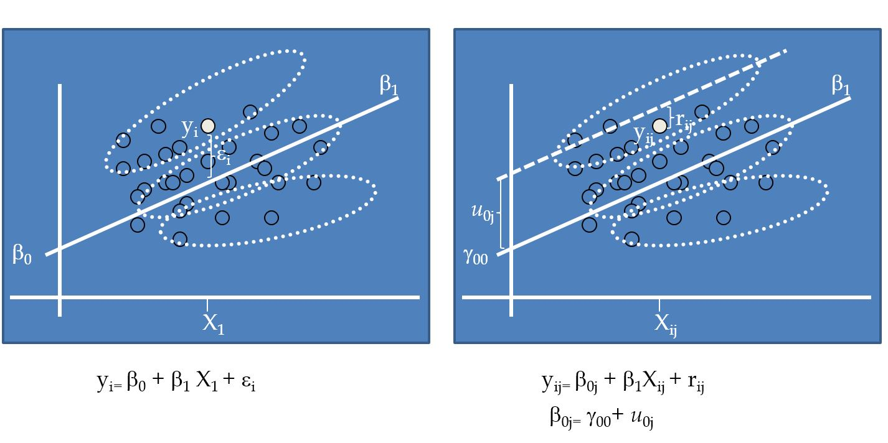
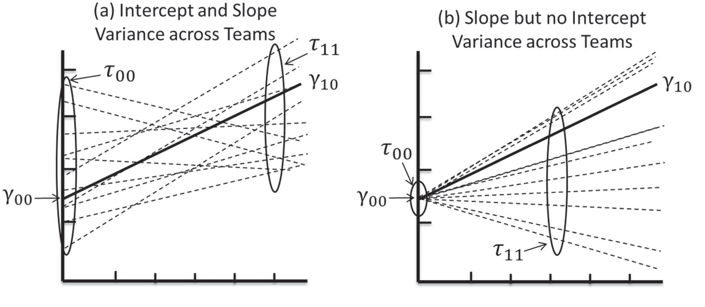
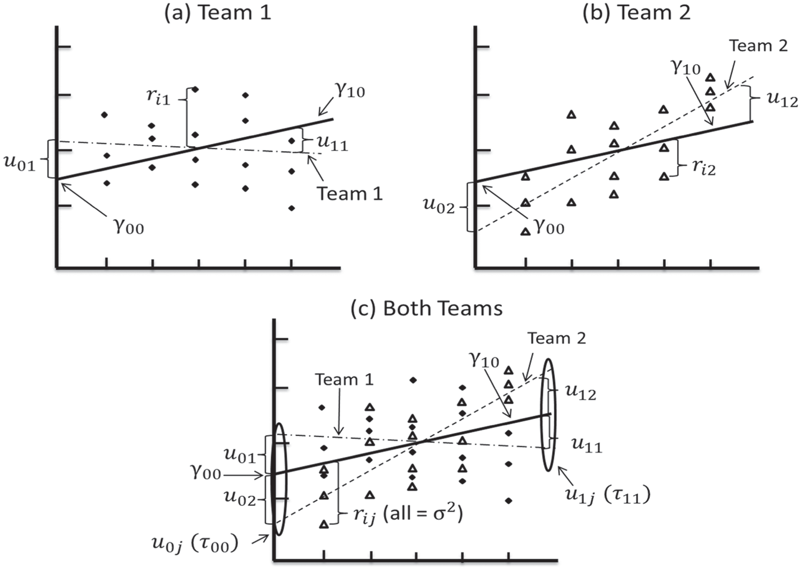

```{r include=FALSE}
library(here)
knitr::opts_knit$set(root.dir = here::here("slides","taller03"))
```

```{r include=FALSE, cache=FALSE, eval=TRUE}
library(texreg)
library(lme4) 
library(readstata13) 
library(lattice)
data_psu<-read.csv("psu_edpad.csv",header=TRUE, sep=",")
data_psu$X= NULL
#------------------------------------------------------------------------------#

```


# Contenidos 

### - Modelo de Regresión Multinivel 
### - Modelos con intercepto aleatorio (Random Intercept)
### - Modelos con pendiente aleatoria (Random Slope)

---
class: center, middle

# Regresión lineal multinivel


 ## $$Y_{ti}= \gamma_{00}+\gamma_{10}X_{ij}+u_{0j} + r_{ij}$$


---
```{r, echo=FALSE, out.width='100%', fig.cap="Ajuste modelo de regresión"}

```

---

```{r, echo=FALSE, out.width='100%', fig.cap=" Modelo con intercepto aleatorio"}

```

---

```{r, echo=FALSE, out.width='100%'}
 
```

---

# Ejemplo:

## - En una empresa existen distintos equipos y trabajadores dentro de cada equipo.


---
class:middle
```{r, echo=FALSE, out.width='100%',fig.align='center'}
 
```


---
 
```{r, echo=FALSE, out.width='75%',fig.align='center'}

```

---
# Paquetes

```{r eval=FALSE, include=TRUE}
# Para instalar las librerías:
install.packages("dplyr")
install.packages("texreg")
install.packages("readstata13")
install.packages("lme4")

library(texreg)
library(lme4) 
library(readstata13) 
library(lattice)
```


---

class:middle, center

# Sitio web del curso:

[**https://jciturras.github.io/met-cuanti-doc19/**](https://jciturras.github.io/met-cuanti-doc19/)
---
class: center, middle

# Taller 04

Slides created via the R package [**xaringan**](https://github.com/yihui/xaringan).

The chakra comes from [remark.js](https://remarkjs.com), [**knitr**](http://yihui.name/knitr), and [R Markdown](https://rmarkdown.rstudio.com).


